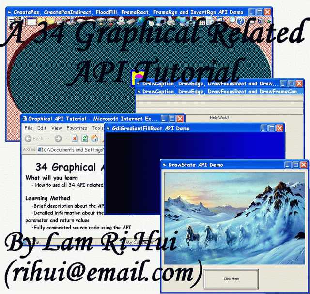



## A 34 Graphical Related API Tutorial

### Description

Finally, I completed a tutorial which teaches you how to use the 34 API related with graphic. You will learn how to use these APIs through detailed information about the API and source code that shows how to use the API. You will not be disapointed if you download this tutorial. Leave comments and vote for me.
 
### More Info
 

             |
---                |---
**Submitted On**   |2003-10-18 16:49:50
**By**             |[Lam Ri Hui](https://github.com/Planet-Source-Code/PSCIndex/blob/master/ByAuthor/lam-ri-hui.md)
**Level**          |Intermediate
**User Rating**    |4.9 (68 globes from 14 users)
**Compatibility**  |VB 5\.0, VB 6\.0
**Category**       |[Windows API Call/ Explanation](https://github.com/Planet-Source-Code/PSCIndex/blob/master/ByCategory/windows-api-call-explanation__1-39.md)
**World**          |[Visual Basic](https://github.com/Planet-Source-Code/PSCIndex/blob/master/ByWorld/visual-basic.md)
**Archive File**   |[A\_34\_Graph16603910182003\.zip](https://github.com/Planet-Source-Code/lam-ri-hui-a-34-graphical-related-api-tutorial__1-49316/archive/master.zip)

